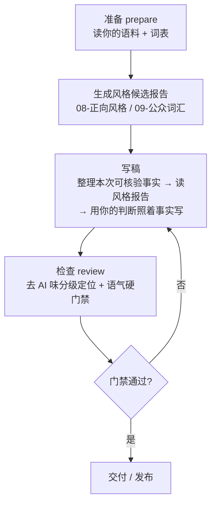

# Article Style Approach — 个人文章写作与去 AI 味的思路复现

> 这是一份**方法/思路**仓库，不是代码实现。它把"用个人风格写中文文章、并系统性去 AI 味"这件事，讲成一套**可以自己复现**的方法论，并把这套方法在真实落地时用到的**数据结构、评分逻辑与检查流程**讲清楚。

这份仓库的核心不是送你一套成品，而是把**这套方法是怎样设计的、每一步为什么这么设计**讲明白，让你（或任何 Agent）照着方法，在自己的数据上复现出一套属于自己的写作 Skill。

想直接上手？——三个文件对应三种用法：

| 文件 | 你想干什么 | 用哪个 |
| --- | --- | --- |
| 快速总览 | 只看核心思路 + 这套设计的优势 | 本文件 |
| 理解原理 | 设计细节、数据、评分逻辑、检查流程 | **[DESIGN.md](DESIGN.md)** |
| 被带着走 | 一段可直接粘贴给 Agent 的引导提示词 | **[PROMPT.md](PROMPT.md)** |

---
---

## 一、这套思路解决什么问题

绝大多数用大模型写文章的人，卡在两个点上：

1. **写出来一股"AI 味"**——句式整齐、爱总结、爱升华、套话一堆，读着不像人写的。
2. **想纠正但不知道查什么**——凭感觉改，改完还是像；或者干脆放弃，认定"AI 写得就是这样"。

这套思路把问题拆成三件可分别解决的事：

- **机制与数据分离**——把"怎么检查/怎么写"的流程（机制）拆开；把"你爱用的词、你反感的套话"（数据）拆开。想换个人、换种风格，只换数据，不换机制。
- **证据优先**——语料和词表只决定**怎么表达**，不决定**写什么**。文章里的人、事、数字只能来自你这次提供的可核验素材，不补造。
- **去 AI 味分级 + 硬门禁**——把"像不像大模型"做成可定位、可量化、可复现的检查；把"你讨厌的套话"做成硬性发布门禁。

一句话概括：**把"写作手感"工程化成"可复现的检查"，而不是依赖一句玄学式的"别写得太像 AI"。**

---

## 二、这套设计的优势

把一篇文章的形成，从"一次性的玄学尝试"改成"一个有流程、有数据、有检查的闭环"，带来的收益是实打实的：

| 设计 | 它在解决什么 | 带来的优势 |
| --- | --- | --- |
| **机制与数据分离** | 脚本/流程和你的私人词表、语料、禁用表达纠缠在一起，无法复用、无法分享 | 换一套数据即换一种风格；私人内容留在本地，公开的永远是纯机制 |
| **证据优先** | AI 容易拿语料"顺口编造"你没做过的事 | 文章只由**本次可核验**素材支撑，杜绝编造经历、数字、对话 |
| **分级去 AI 味（L1–L6）** | 笼统说"有点 AI 味"无法定位问题 | 把"像不像 AI"拆成六级、六维、0–100 分，**改稿有对象** |
| **一软一硬** | 把"该不该改"和"必须改"混为一谈 | 去 AI 味是**提示**（贴切可保留），语气门禁是**硬规则**（命中即拦），职责清晰 |
| **检查不改正文** | 脚本擅自改文，可能破坏你原来的意思 | 检查只**定位和拦截**，改不改、留不留由你决定，人始终在回路里 |

**相比"写完让它自己润色"的做法**：润色是事后整篇重写、不可控；这套是**成稿前按记忆中的风格写 + 成稿后逐点定位、逐点门禁**，每一步都可回查、可回滚。

---

## 三、写作的三步闭环

整个流程是一个 `准备 → 写稿 → 检查` 的闭环，不是"写一稿就完事"：



| 动作 | 输入 | 输出 | 限制（它不做什么） |
| --- | --- | --- | --- |
| **准备** | 你的语料 + `persona` 词表 + 分类规则 | 风格候选报告（词/句式/连接词命中） | 不写正文、不生成你没做的事 |
| **写稿** | 本次你提供的可核验事实 + 风格报告 | 一篇用你的语气写成的草稿 | 不靠词库编造经历 |
| **检查** | 草稿 | 分级命中 + 0–100 痕迹总分 + 六维指标；门禁通过/拦截 | 不自动改写、不鉴定"是不是 AI 写的" |

关键分工：**准备只读不改**（报告是"你过去爱怎么写"的统计，不是"该写什么"的授权）；**写稿以事实为准**（缺证据就写明待验证）；**检查只检查与拦截**（提示你改，硬门禁必须改）。

---

## 四、去 AI 味的核心方案：分级 + 门禁

去 AI 味不是一句口号，而是**两层互补**的检查。

### 第一层：分级定位（flavor-lib 思路）

把"像不像大模型"拆成 **L1–L6 六个等级**，按嫌疑强度递进，每一级有针对性处理策略：

| 级别 | 检查什么 | 命中处理 | 计分 |
| --- | --- | --- | --- |
| **L1** | 普通高频词（仅统计密度） | 密度异常才加分 | 每千字超阈值 +1~+2 |
| **L2** | AI 偏好词（如"赋能""底层逻辑"） | 限制密度 | **每个 +1** |
| **L3** | 强 AI 短语 | 优先改写 | **每个 +2** |
| **L4** | 强 AI 固定句式（正则） | 建议改 | **每个 +4** |
| **L5** | AI 模板结构（三点式 / 逐节总结 / 结尾升华） | 强制打散 | **每个 +8** |
| **L6** | 组合指纹（多特征同文共现） | 强改写 | **每个 +10** |

除了逐级计分，还有一组**附加规则**（同样来自落地时的评分模型）：

| 附加规则 | 加分 |
| --- | --- |
| 同一句同时命中 ≥2 个 L3/L4 | +3 |
| 三个结构相似的段落 | +8 |
| 结尾出现强制升华句 | +5 |
| 命中"三点式"模板结构 | +5 |
| 每千字强特征（L3+）超过 15 个 | +10 |

所有加分总和**上限 100**。根据总分落入不同的**区间标签**：

| 总分区间 | 标签 |
| --- | --- |
| 0–15 | 自然 |
| 16–30 | 轻微 AI 痕迹 |
| 31–50 | 明显 AI 痕迹 |
| 51–70 | 强 AI 风格 |
| 71–85 | 高度模板化 AI 风格 |
| 86–100 | 典型大模型生成文风 |

除了总分，还有**六维指标**（各 0–100），帮你分清"是词像 AI，还是结构像 AI"：

| 维度 | 含义 | 命中数的归一化上限 |
| --- | --- | --- |
| `vocabulary_score` | 词汇 AI 化程度 | 8 个命中 = 严重 |
| `phrase_score` | AI 高频短语程度 | 6 个 = 严重 |
| `sentence_pattern_score` | AI 模板句式程度 | 4 个 = 严重 |
| `structure_score` | 文章结构模板化程度 | 2 个 = 严重 |
| `repetition_score` | 重复表达程度 | 6 种 = 严重 |
| `elevation_score` | 结尾强行升华程度 | 存在即严重 |

> **关键界限**：这套分级**只报告"文风像不像大模型"，不鉴定"是不是 AI 写的"，也不自动改写**。它给你一个可定位的对象（哪一行、哪一维、多少分），让你知道该改哪里，而不是替你下结论。

**检查流程示意**（真实实现的逻辑，用伪代码表达，不涉及具体写法）：

```text
load_library()                       # 读 L1–L6 词库/句式/结构 + 评分模型
prose_lines(article)                 # 剥离 frontmatter/代码块/表格/引用/链接，只留正文与标题
  for L1/L2/L3 词与短语:             # 逐行正则命中 → 记录 行号/级别/规则/上下文片段
  for L4 句式正则:                   # 命中 → L4 记录
_detect_structure(lines)             # L5 模板结构 + L6 组合指纹
_score_report(...)                   # 汇总：
   score = L2n*1 + L3n*2 + L4n*4 + L5n*8 + L6n*10
           + 附加规则加分             # 同句>2·三点式·升华·重复段落·超密度
   score = min(score, 100)
   metrics = 各维度命中数 / cap → 0-100 归一化
_score_label(score, levels)          # 取最后一个 >=min 的区间 → 标签
return  { han_characters, counts, findings,
          detections, ai_trace_score, level,
          metrics }                  # 机器可读结果 + 人类可读的定位
```

### 第二层：硬门禁（tone-gate 思路）

去 AI 味是**手感问题**，是提示性的；但"你反感的套话"是**你的发布刹车**，应该做成硬性检查：

| 规则类型 | 行为 | 例子（占位） |
| --- | --- | --- |
| `禁用表达` | 出现即判失败 | 你反感的套话，一出现就拦截 |
| `句式规则` | 正则匹配即判失败 | 前后对比的固定句式模板，命中即拦 |
| `限用词` | 超过 N 次即判失败 | 如"链路""边界"最多 2 次 |

一层检查同时跑这两件事：**先去重定位 AI 痕迹（提示），再跑硬门禁（拦截）**；门禁失败则整体判为不通过、要求改稿。

两层的分工一句话：**去 AI 味是提示（该不该改你定），语气门禁是硬规则（必须改）**。前者看你写得像不像，后者守你绝不写什么。

---

## 五、设计原则（长期可参考）

- **统计是候选，不是定论**：风格报告统计文本特征，不证明作者身份；分级命中是写作痕迹提示，不是 AI 作者鉴定。
- **机制与数据分离**：流程不硬编码任何"谁"的词表或禁用表达，只读你自己的数据层。想换风格，换数据即可。
- **证据优先**：检查只提取和定位；文章由你根据本次可核验素材写成。
- **一软一硬**：去 AI 味是提示，语气门禁是唯一硬性发布检查。

---

## 六、许可

[MIT](LICENSE)。Copyright (c) 2026 Alan_Hsu。