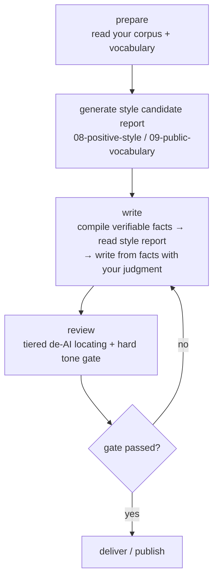

<p align="center">
  
  
  
</p>

<h1 align="center">Article Style Approach</h1>

<p align="center">
  A reproducible methodology for writing articles in your own voice and systematically removing the "AI flavor."
</p>

<p align="center">
  <a href="./README.zh-CN.md">中文</a> ·
  <a href="./README.md">English</a>
</p>

<p align="center"><b>Mechanism/data separation · Evidence-first · Tiered de-AI + hard tone gate</b></p>

---

## Table of Contents

- [What it is](#what-it-is)
- [Why](#why)
- [Core Concepts](#core-concepts)
- [Repository Structure](#repository-structure)
- [Quick Start](#quick-start)
- [Features & Design](#features--design)
- [Design Principles](#design-principles)
- [License](#license)

---

## What it is

This is a **methodology / idea** repository, not a code implementation. It turns "write Chinese articles in your own voice, and systematically remove the AI flavor" into a **reproducible approach**, and explains the **data structures, scoring logic, and check flow** used when the method is actually applied.

The point is not to hand you a finished product, but to explain **how the method is designed and why each step is designed that way**, so that you (or any agent) can reproduce your own writing skill on your own data.

Three files, three ways to use it:

| File | What you want | Use |
| --- | --- | --- |
| Quick overview | Core idea + why the design works | `README.md` |
| Understand the design | Details, data, scoring logic, check flow | **[DESIGN.md](DESIGN.md)** |
| Guided setup | A copy-paste prompt for an agent | **[PROMPT.md](PROMPT.md)** |

---

## Why

Most people writing with LLMs get stuck on two things:

1. **Output reads "AI-flavored"** — tidy sentences, constant summarizing and elevating, filler phrases; it doesn't read human.
2. **They don't know what to check** — fixing by feel still looks AI-like; or they give up, assuming "this is just how AI writes."

This approach splits the problem into three separately solvable pieces:

| Design | What it solves | Payoff |
| --- | --- | --- |
| **Mechanism/data separation** | Scripts/flow tangled with your private vocabulary, corpus, banned phrases → not reusable, not shareable | Swap data for a new style; private content stays local, only pure mechanism is public |
| **Evidence-first** | AI tends to "invent" things you never did from the corpus | Articles are supported only by **verifiable** material provided this time — no fabricated experiences, numbers, or dialogue |
| **Tiered de-AI (L1–L6)** | "It feels a bit AI-ish" is too vague to act on | Break *AI-likeness* into six levels, six dimensions, 0–100 score — **something concrete to edit** |
| **One soft, one hard** | Confusing "should I change it" with "must change it" | De-AI is a **suggestion** (keep if apt); the tone gate is a **hard rule** (block on hit), clearly separated |
| **Check never rewrites** | Scripts auto-editing may break your meaning | Checks only **locate and block**; you decide to change or keep — a human stays in the loop |

Compared with "let it polish itself after writing": polishing is an uncontrolled whole-text rewrite afterward; this works as **write from memory of style before the draft + locate/block point-by-point after**, every step traceable and reversible.

---

## Core Concepts

### The three-step writing loop

The whole flow is a `prepare → write → check` loop, not "finish in one draft":



| Step | Input | Output | Constraint (what it does NOT do) |
| --- | --- | --- | --- |
| **Prepare** | Your corpus + `persona` vocabulary + classification rules | Style candidate report (words/phrases/connectors hits) | Does not write prose, does not invent things you never did |
| **Write** | Verifiable facts you provide + style report | A draft written in your tone | Does not fabricate experience from a lexicon |
| **Check** | The draft | Tiered hits + 0–100 trace score + six-dimension metrics; gate pass/block | Does not auto-rewrite, does not judge "was this AI-written" |

Key division of labor: **prepare only reads, never edits** (the report is statistics of how you write, not an authorization of what to write); **write is fact-based** (missing evidence → mark as to-verify); **check only checks and blocks** (suggests edits; the hard gate enforces).

### Tiered de-AI (flavor-lib)

"AI-likeness" is broken into **six levels L1–L6**, by increasing suspicion:

| Level | What it checks | On hit | Score |
| --- | --- | --- | --- |
| **L1** | Common high-frequency words (density only) | only if density abnormal | +1~+2 per 1000 chars above threshold |
| **L2** | AI-preferred words (e.g. "赋能", "底层逻辑") | cap density | **+1 each** |
| **L3** | Strong AI phrases | rewrite first | **+2 each** |
| **L4** | Strong AI fixed sentence patterns (regex) | suggest edit | **+4 each** |
| **L5** | AI template structures (three-point / per-section summary / closing elevation) | force restructure | **+8 each** |
| **L6** | Composite fingerprints (multiple features co-occurring) | strong rewrite | **+10 each** |

Extra rules: ≥2 L3/L4 in one sentence (+3), three structurally similar paragraphs (+8), forced closing elevation (+5), three-point template (+5), >15 strong features per 1000 chars (+10). Total capped at **100**, mapped to six level labels (0–15 natural → 86–100 typical LLM prose).

Beyond the total, **six dimension metrics** (each 0–100) tell you whether it's the words or the structure that look AI: vocabulary / phrase / sentence-pattern / structure / repetition / elevation.

> **Key boundary**: these tiers only **report how AI-like the style is — they do not decide "was it written by AI," and do not auto-rewrite**. They give a concrete target (which line, which dimension, how many points) so you know where to edit.

### The hard tone gate

De-AI is a **feel** problem and is suggestive; but "the filler you dislike" is **your publish brake** and should be a hard check:

| Rule type | Behavior | Example (placeholder) |
| --- | --- | --- |
| `banned` | fail on any occurrence | your disliked filler, blocked the moment it appears |
| `pattern` | regex match fails | a fixed before/after contrast template, blocked on hit |
| `limited` | fail above N uses | e.g. "链路"/"边界" at most 2 times |

One check runs both: **first the tiered de-AI locating (suggestion), then the hard tone gate (block)**; a gate failure makes the whole review fail and asks for a rewrite.

---

## Repository Structure

```text
article-style-approach/
├── README.md              # English overview (this file)
├── README.zh-CN.md        # Chinese overview
├── DESIGN.md              # Design doc: data structures, scoring logic, check flow (pseudocode)
├── PROMPT.md              # Copy-paste, step-by-step agent setup prompt
├── LICENSE                # MIT
└── .gitignore             # excludes private corpus / build artifacts
```

| File | Responsibility |
| --- | --- |
| `README.md` / `README.zh-CN.md` | Quick overview: core idea + design payoffs + loop + tiers/gate |
| `DESIGN.md` | The design: mechanism/data separation, data layer, scoring model, orchestration, evidence-first discipline |
| `PROMPT.md` | Guides an agent through 8 verifiable steps to build your own writing skill from scratch |

> Paths like `config/persona.json`, `references/sources/` are **concept demos** showing how you might organize data in your own directory; this repo contains none of them and no implementation.

---

## Quick Start

This is a pure methodology / docs repo — nothing to install, build, or test. Three ways in:

```bash
# 1. Quick overview (core idea + payoffs)
#    open README.md (EN) or README.zh-CN.md (ZH)

# 2. Understand the design (scoring / check flow / data structures)
#    open DESIGN.md

# 3. Guided setup (agent prompt)
#    open PROMPT.md and copy the whole block into your agent
```

To build your own writing skill: copy `PROMPT.md` into your agent (Codex / Claude Code / OpenCode), which will guide you step by step through defining your directory, corpus, vocabulary, tone gate, and check mechanism.

---

## Features & Design

See [DESIGN.md](DESIGN.md) and [PROMPT.md](PROMPT.md). Core capabilities:

- **Mechanism/data separation** — the flow never hard-codes anyone's vocabulary or banned expressions; it only reads your data layer. Swap data to change style.
- **Evidence-first** — style statistics decide only *how* to express; people, facts, and numbers in an article must come from the verifiable material you provide, never fabricated.
- **Tiered de-AI + hard tone gate** — de-AI is a suggestion (you decide whether to change); the tone gate is the only hard publish check.

---

## Design Principles

- **Statistics are candidates, not verdicts** — a style report measures text features, it doesn't prove authorship; tier hits are writing-trace hints, not an AI-authorship verdict.
- **Mechanism/data separation** — the flow never hard-codes anyone's vocabulary or banned expressions; it only reads your data layer.
- **Evidence-first** — checks only extract and locate; articles are written by you from this session's verifiable material.
- **One soft, one hard** — de-AI is a suggestion; the tone gate is the only hard publish check.

---

## License

[MIT](LICENSE). Copyright (c) 2026 Alan_Hsu.