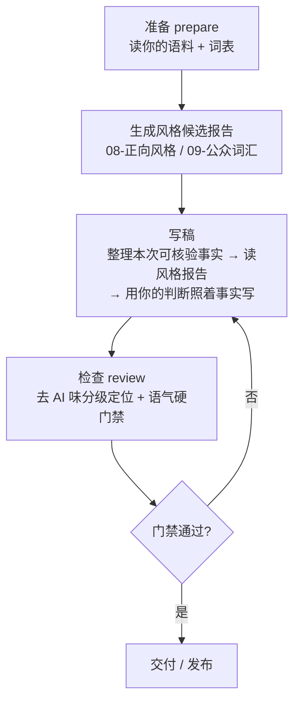

<p align="center">
  
  
  
</p>

<h1 align="center">Article Style Approach</h1>

<p align="center">
  个人文章写作与去 AI 味的思路复现——把「写作手感」工程化成可复现的检查。
</p>

<p align="center">
  <a href="./README.md">English</a> ·
  <a href="./README.zh-CN.md">中文</a>
</p>

<p align="center"><b>机制与数据分离 · 证据优先 · 分级去 AI 味 + 硬门禁</b></p>

---

## 目录

- [这是什么](#这是什么)
- [为什么需要](#为什么需要)
- [核心概念](#核心概念)
- [仓库结构](#仓库结构)
- [快速使用](#快速使用)
- [功能与设计思路](#功能与设计思路)
- [设计原则](#设计原则)
- [许可](#许可)

---

## 这是什么

这是一份**方法/思路**仓库，不是代码实现。它把「用个人风格写中文文章、并系统性去 AI 味」这件事，讲成一套**可以自己复现**的方法论，并把这套方法在真实落地时用到的**数据结构、评分逻辑与检查流程**讲清楚。

核心不是送你一套成品，而是把**这套方法是怎样设计的、每一步为什么这么设计**讲明白，让你（或任何 Agent）照着方法，在自己的数据上复现出一套属于自己的写作 Skill。

想直接上手？三个文件对应三种用法：

| 文件 | 你想干什么 | 用哪个 |
| --- | --- | --- |
| 快速总览 | 只看核心思路 + 这套设计的优势 | `README.zh-CN.md` |
| 理解原理 | 设计细节、数据、评分逻辑、检查流程 | **[DESIGN.md](DESIGN.md)** |
| 被带着走 | 一段可直接粘贴给 Agent 的引导提示词 | **[PROMPT.md](PROMPT.md)** |

---

## 为什么需要

绝大多数用大模型写文章的人，卡在两个点上：

1. **写出来一股「AI 味」**——句式整齐、爱总结、爱升华、套话一堆，读着不像人写的。
2. **想纠正但不知道查什么**——凭感觉改，改完还是像；或者干脆放弃，认定「AI 写得就是这样」。

这套思路把问题拆成三件可分别解决的事：

| 设计 | 它在解决什么 | 带来的优势 |
| --- | --- | --- |
| **机制与数据分离** | 脚本/流程和你的私人词表、语料、禁用表达纠缠在一起，无法复用、无法分享 | 换一套数据即换一种风格；私人内容留在本地，公开的永远是纯机制 |
| **证据优先** | AI 容易拿语料「顺口编造」你没做过的事 | 文章只由**本次可核验**素材支撑，杜绝编造经历、数字、对话 |
| **分级去 AI 味（L1–L6）** | 笼统说「有点 AI 味」无法定位问题 | 把「像不像 AI」拆成六级、六维、0–100 分，**改稿有对象** |
| **一软一硬** | 把「该不该改」和「必须改」混为一谈 | 去 AI 味是**提示**（贴切可保留），语气门禁是**硬规则**（命中即拦），职责清晰 |
| **检查不改正文** | 脚本擅自改文，可能破坏你原来的意思 | 检查只**定位和拦截**，改不改、留不留由你决定，人始终在回路里 |

相比「写完让它自己润色」的做法：润色是事后整篇重写、不可控；这套是**成稿前按记忆中的风格写 + 成稿后逐点定位、逐点门禁**，每一步都可回查、可回滚。

---

## 核心概念

### 写作的三步闭环

整个流程是一个 `准备 → 写稿 → 检查` 的闭环，不是「写一稿就完事」：



| 动作 | 输入 | 输出 | 限制（它不做什么） |
| --- | --- | --- | --- |
| **准备** | 你的语料 + `persona` 词表 + 分类规则 | 风格候选报告（词/句式/连接词命中） | 不写正文、不生成你没做的事 |
| **写稿** | 本次你提供的可核验事实 + 风格报告 | 一篇用你的语气写成的草稿 | 不靠词库编造经历 |
| **检查** | 草稿 | 分级命中 + 0–100 痕迹总分 + 六维指标；门禁通过/拦截 | 不自动改写、不鉴定「是不是 AI 写的」 |

关键分工：**准备只读不改**（报告是「你过去爱怎么写」的统计，不是「该写什么」的授权）；**写稿以事实为准**（缺证据就写明待验证）；**检查只检查与拦截**（提示你改，硬门禁必须改）。

### 分级去 AI 味（flavor-lib 思路）

把「像不像大模型」拆成 **L1–L6 六个等级**，按嫌疑强度递进：

| 级别 | 检查什么 | 命中处理 | 计分 |
| --- | --- | --- | --- |
| **L1** | 普通高频词（仅统计密度） | 密度异常才加分 | 每千字超阈值 +1~+2 |
| **L2** | AI 偏好词（如「赋能」「底层逻辑」） | 限制密度 | **每个 +1** |
| **L3** | 强 AI 短语 | 优先改写 | **每个 +2** |
| **L4** | 强 AI 固定句式（正则） | 建议改 | **每个 +4** |
| **L5** | AI 模板结构（三点式 / 逐节总结 / 结尾升华） | 强制打散 | **每个 +8** |
| **L6** | 组合指纹（多特征同文共现） | 强改写 | **每个 +10** |

附加规则：同句命中 ≥2 个 L3/L4（+3）、三个结构相似段落（+8）、结尾强制升华（+5）、三点式模板（+5）、每千字强特征超 15 个（+10）。总分上限 **100**，落入六级区间标签（0–15 自然 → 86–100 典型大模型文风）。

除总分外还有**六维指标**（各 0–100），分清「是词像 AI 还是结构像 AI」：词汇/短语/句式/结构/重复/升华。

> **关键界限**：这套分级**只报告「文风像不像大模型」，不鉴定「是不是 AI 写的」，也不自动改写**。它给你一个可定位的对象（哪一行、哪一维、多少分），让你知道该改哪里。

### 硬门禁（tone-gate 思路）

去 AI 味是**手感问题**，是提示性的；但「你反感的套话」是**你的发布刹车**，应该做成硬性检查：

| 规则类型 | 行为 | 例子（占位） |
| --- | --- | --- |
| `禁用表达` | 出现即判失败 | 你反感的套话，一出现就拦截 |
| `句式规则` | 正则匹配即判失败 | 前后对比的固定句式模板，命中即拦 |
| `限用词` | 超过 N 次即判失败 | 如「链路」「边界」最多 2 次 |

一层检查同时跑两件事：**先分级定位 AI 痕迹（提示），再跑硬门禁（拦截）**；门禁失败则整体判为不通过、要求改稿。

---

## 仓库结构

```text
article-style-approach/
├── README.md              # 英文版总览（本文件为中文版）
├── README.zh-CN.md        # 中文版总览
├── DESIGN.md              # 设计说明：数据结构、评分逻辑、检查流程（伪代码）
├── PROMPT.md              # 可复制给 Agent 的分步搭建引导提示词
├── LICENSE                # MIT
└── .gitignore             # 排除私人语料/构建产物
```

| 文件 | 职责 |
| --- | --- |
| `README.zh-CN.md` / `README.md` | 快速总览：核心思路 + 设计优势 + 闭环 + 分级/门禁 |
| `DESIGN.md` | 理解原理：机制与数据分离、数据层、评分模型、编排、证据优先纪律 |
| `PROMPT.md` | 让 Agent 分 8 步带你从零搭建属于你自己的写作 Skill，每步可验收 |

> 文中出现的 `config/persona.json`、`references/sources/` 等路径均为**概念演示**，示意你在自己的目录里如何组织数据；本仓库不含这些文件、不含任何实现。

---

## 快速使用

本仓库是纯方法论文档，不需要安装、构建或测试。三种打开方式：

```bash
# 1. 快速总览（核心思路 + 优势）
#    打开 README.zh-CN.md（中文）或 README.md（英文）

# 2. 理解原理（评分逻辑 / 检查流程 / 数据结构）
#    打开 DESIGN.md

# 3. 被带着走（给 Agent 的搭建提示词）
#    打开 PROMPT.md，整段复制给你常用的 Agent
```

想落地成你自己的写作 Skill：把 `PROMPT.md` 整段复制给 Agent（Codex / Claude Code / OpenCode 均可），它会一步步引导你定义目录、语料、词表、门禁与检查机制。

---

## 功能与设计思路

详见 [DESIGN.md](DESIGN.md) 与 [PROMPT.md](PROMPT.md)。核心能力一览：

- **机制与数据分离**：流程不硬编码任何「谁」的词表或禁用表达，只读你自己的数据层；换风格即换数据。
- **证据优先**：风格统计只决定「怎么表达」；文章里的人、事、数字只能来自你本次提供的可核验素材，不补造。
- **分级去 AI 味 + 硬门禁**：去 AI 味是提示（该不该改你定），语气门禁是唯一硬性发布检查。

---

## 设计原则

- **统计是候选，不是定论**：风格报告统计文本特征，不证明作者身份；分级命中是写作痕迹提示，不是 AI 作者鉴定。
- **机制与数据分离**：流程不硬编码任何「谁」的词表或禁用表达，只读你自己的数据层。
- **证据优先**：检查只提取和定位；文章由你根据本次可核验素材写成。
- **一软一硬**：去 AI 味是提示，语气门禁是唯一硬性发布检查。

---

## 许可

[MIT](LICENSE)。Copyright (c) 2026 Alan_Hsu。